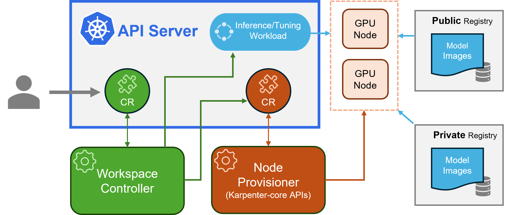
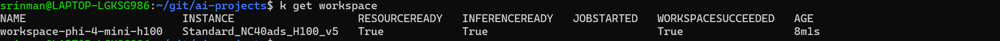
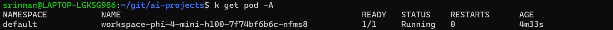
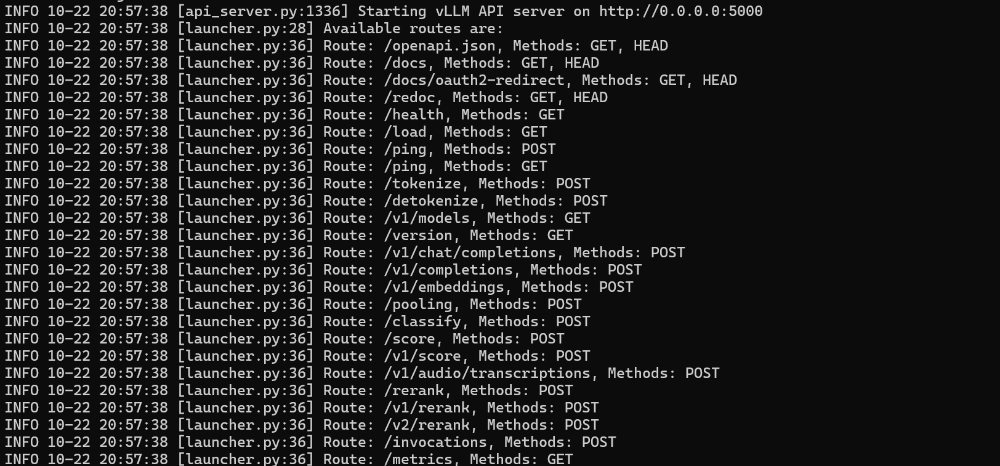
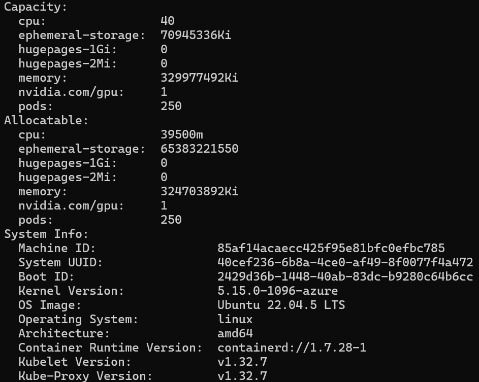

# KAITO (Kubernetes AI Toolchain Operator) - Complete Guide

## 🚀 Introduction to KAITO

**KAITO** (Kubernetes AI Toolchain Operator) is a Cloud Native Computing Foundation (CNCF) Sandbox project that simplifies the deployment and management of open-source Large Language Models (LLMs) on Kubernetes. It's designed for organizations that want to self-host AI models while maintaining control over their data and reducing per-token API costs.

### Why KAITO?

- **Cost Efficiency**: Avoid expensive per-token pricing models
- **Data Privacy**: Keep sensitive data within your controlled environment
- **Customization**: Fine-tune and customize models for your specific needs
- **Scalability**: Leverage Kubernetes for robust, scalable AI workloads
- **Security**: Maintain strict control over data in regulated sectors

### Key Features

- 🔧 **Modular Setup**: Plug-and-play architecture for quick deployments
- 🌐 **OpenAI-Compatible APIs**: Standard API formats for easy integration
- ⚡ **vLLM Integration**: High-throughput inference engine for efficient serving
- 📝 **Prompt Formatting**: Built-in support for various prompt templates
- 🔄 **Streaming Support**: Real-time response streaming capabilities
- 🎯 **GPU Optimization**: Automatic resource allocation and optimization

https://kaito-project.github.io/kaito/docs/#architecture   



---

## 📋 Prerequisites

### System Requirements
- Azure subscription with GPU VM quota
- Azure CLI version 2.76.0 or later
- kubectl installed and configured
- Basic understanding of Kubernetes concepts

### Supported Configurations
- ✅ **OS**: Ubuntu, CentOS, RHEL (AzureLinux and Windows not supported)
- ✅ **GPU**: NVIDIA GPU VM sizes (AMD GPU not supported)
- ✅ **Regions**: All public Azure regions

---

## 🛠️ Step-by-Step Deployment Guide

### Step 1: Environment Setup

First, let's set up our environment variables:

```bash
# Export environment variables
export AZURE_RESOURCE_GROUP="kaito-rg"
export AZURE_LOCATION="eastus2"
export CLUSTER_NAME="kaito-aks"

# Verify Azure CLI login
az account show
```

### Step 2: Create Resource Group

```bash
# Create Azure resource group
az group create \
    --name $AZURE_RESOURCE_GROUP \
    --location $AZURE_LOCATION
```

### Step 3: Create AKS Cluster with KAITO Add-on

```bash
# Create AKS cluster with AI toolchain operator enabled
az aks create \
    --location $AZURE_LOCATION \
    --resource-group $AZURE_RESOURCE_GROUP \
    --name $CLUSTER_NAME \
    --enable-ai-toolchain-operator \
    --enable-oidc-issuer \
    --node-count 1 \
    --generate-ssh-keys \
    --tier standard

# Alternative: Enable on existing cluster
# az aks update \
#     --name $CLUSTER_NAME \
#     --resource-group $AZURE_RESOURCE_GROUP \
#     --enable-ai-toolchain-operator \
#     --enable-oidc-issuer
```

### Step 4: Connect to Your Cluster

```bash
# Configure kubectl
az aks get-credentials \
    --resource-group $AZURE_RESOURCE_GROUP \
    --name $CLUSTER_NAME

# Verify connection
kubectl get nodes
kubectl get pods -n kube-system | grep kaito
```

---

## 🎯 Demo 1: Microsoft Phi-4-Mini Model

This demo deploys the high-performant multimodal Microsoft Phi-4-mini language model.

### Deploy Phi-4-Mini Model

```bash
# Option 1: Deploy with default instance type (A100)
kubectl apply -f https://raw.githubusercontent.com/kaito-project/kaito/refs/heads/main/examples/inference/kaito_workspace_phi_4_mini.yaml

# Option 2: Deploy with custom instance type (H100)
# Create a custom workspace configuration for H100 GPU
cat > phi-4-mini-h100.yaml << EOF
apiVersion: kaito.sh/v1beta1
kind: Workspace
metadata:
  name: workspace-phi-4-mini-h100
resource:
  instanceType: "Standard_NC40ads_H100_v5"
  labelSelector:
    matchLabels:
      apps: phi-4-h100
inference:
  preset:
    name: phi-4-mini-instruct
EOF

# Deploy with H100 GPU
kubectl apply -f phi-4-mini-h100.yaml
```


```bash
# Deploy the Phi-4-mini instruct model
# This command downloads and applies a KAITO workspace configuration that:
# - Creates a Workspace custom resource for Phi-4-Mini model
# - Automatically provisions GPU-enabled nodes (if needed)
# - Deploys the model container with vLLM inference engine
# - Sets up a Kubernetes service for API access
# - Configures OpenAI-compatible API endpoints
kubectl apply -f https://raw.githubusercontent.com/kaito-project/kaito/refs/heads/main/examples/inference/kaito_workspace_phi_4_mini.yaml

# Track deployment progress (this can take 10-20 minutes)
# The workspace will go through these phases:
# 1. Pending - Initial resource creation
# 2. NodeClaiming - Provisioning GPU nodes
# 3. NodeReady - Node is available
# 4. WorkspaceReady - Model is loaded and serving
kubectl get workspace workspace-phi-4-mini-h100 -w

# Alternative: Check status without watching
kubectl get workspace workspace-phi-4-mini-h100

# Example output during deployment:
# NAME                        INSTANCE                   RESOURCEREADY   INFERENCEREADY   JOBSTARTED   WORKSPACESUCCEEDED   AGE
# workspace-phi-4-mini-h100   Standard_NC40ads_H100_v5   False           False            False        False                2m
#
# Status meanings:
# - INSTANCE: GPU VM type being provisioned (Standard_NC40ads_H100_v5 = H100 GPU)
# - RESOURCEREADY: True when GPU nodes are provisioned and available
# - INFERENCEREADY: True when model container is running and healthy
# - JOBSTARTED: True when inference workload has started
# - WORKSPACESUCCEEDED: True when everything is ready and serving requests
#
# Deployment progression:
# RESOURCEREADY: False → True (node provisioning complete)
# INFERENCEREADY: False → True (model loaded and container healthy)
# WORKSPACESUCCEEDED: False → True (ready to serve requests)
```

#### What happens during deployment:
1. **Resource Planning**: KAITO analyzes the model requirements (GPU memory, compute)
2. **Node Provisioning**: Automatically creates GPU-enabled nodes if none are available
3. **Image Pulling**: Downloads the pre-built Phi-4-Mini model image (~2-4GB)
4. **Model Loading**: Loads the model into GPU memory using vLLM
5. **Service Creation**: Exposes the model via Kubernetes service with OpenAI-compatible API
6. **Health Checks**: Verifies the model is responding correctly

#### Expected timeline:
- **0-2 minutes**: Workspace creation and validation
- **2-10 minutes**: Node provisioning (if new GPU nodes needed)
- **10-15 minutes**: Container image download and model loading
- **15-20 minutes**: Final health checks and service readiness

### Monitor Deployment

```bash
# Check workspace status (current state)
kubectl describe workspace workspace-phi-4-mini-h100

# Monitor workspace status changes in real-time
kubectl get workspace workspace-phi-4-mini-h100 -w

# Check if GPU nodes are being provisioned
kubectl get nodes -o wide

# Check pods status
kubectl get pods -l app=workspace-phi-4-mini-h100

# Check events for troubleshooting
kubectl get events --sort-by=.metadata.creationTimestamp

# Check node provisioning specifically
kubectl get nodes -l kaito.sh/workspace=workspace-phi-4-mini-h100

# Monitor node pool creation (may take 5-10 minutes)
az aks nodepool list --resource-group $AZURE_RESOURCE_GROUP --cluster-name $CLUSTER_NAME -o table
```



   
k logs workspace-phi-4-mini-h100-7f74bf6b6c-nfms8   



#### What's happening now:
1. **Azure is provisioning** a `Standard_NC40ads_H100_v5` VM (H100 GPU)
2. **Node pool creation** in your AKS cluster (5-10 minutes)
3. **Once nodes are ready**, RESOURCEREADY will change to True
4. **Then model container** will be deployed and loaded (5-10 more minutes)

### Test the Model

```bash
# Get service IP for H100 workspace
export SERVICE_IP=$(kubectl get svc workspace-phi-4-mini-h100 -o jsonpath='{.spec.clusterIP}')

# Test with a simple prompt
kubectl run -it --rm --restart=Never curl --image=curlimages/curl -- \
curl -X POST http://$SERVICE_IP/v1/completions \
-H "Content-Type: application/json" \
-d '{
    "model": "phi-4-mini-instruct",
    "prompt": "Explain quantum computing in simple terms",
    "max_tokens": 100
}'

# Test with chat completions API
kubectl run -it --rm --restart=Never curl --image=curlimages/curl -- \
curl -X POST http://$SERVICE_IP/v1/chat/completions \
-H "Content-Type: application/json" \
-d '{
    "model": "phi-4-mini-instruct",
    "messages": [
        {
            "role": "user",
            "content": "Write a Python function to calculate fibonacci numbers"
        }
    ],
    "max_tokens": 200
}'
```


### Complete Cleanup

```bash
# Delete all workspaces
kubectl delete workspace --all

# Delete the entire cluster
az aks delete \
    --name $CLUSTER_NAME \
    --resource-group $AZURE_RESOURCE_GROUP \
    --yes --no-wait

# Delete resource group
az group delete \
    --name $AZURE_RESOURCE_GROUP \
    --yes --no-wait
```

---

## 🔍 Troubleshooting

### Common Issues and Solutions

#### 1. Workspace Not Ready
```bash
# Check quota issues
az vm list-usage --location $AZURE_LOCATION -o table | grep -i gpu

# Request quota increase if needed
# Go to Azure Portal > Subscriptions > Usage + quotas
```

#### 2. Pod Scheduling Issues
```bash
# Check node availability
kubectl describe nodes

# Check resource constraints
kubectl describe workspace workspace-name

# Verify GPU drivers
kubectl get pods -n kube-system | grep nvidia
```

#### 3. Service Connection Issues
```bash
# Check service endpoints
kubectl get endpoints

# Verify network policies
kubectl get networkpolicies

# Test internal connectivity
kubectl run debug --image=curlimages/curl -it --rm -- /bin/sh
```

### Useful Debug Commands

```bash
# Get comprehensive cluster info
kubectl cluster-info dump

# Check KAITO operator logs (correct pod names)
kubectl logs -n kube-system -l app=kaito-workspace

# Check KAITO NVIDIA device plugin
kubectl logs -n kube-system -l app=kaito-nvidia-device-plugin

# Describe all resources in workspace
kubectl describe all -l kaito.sh/workspace=workspace-name

# Verify KAITO CRDs are installed
kubectl get crd | grep kaito

# Check KAITO system pods
kubectl get pods -n kube-system | grep kaito
```

### Note on Pod Names
The KAITO components are named with "kaito" prefix, not "ai-toolchain":
- `kaito-workspace-*` - Main KAITO controller
- `kaito-nvidia-device-plugin-*` - GPU device plugin

---

## 📚 Additional Resources


https://kaito-project.github.io/kaito/docs/quick-start  

### Model Registry
- [KAITO Model Registry](https://github.com/kaito-project/kaito/tree/main/presets)
- [Supported Models List](https://github.com/kaito-project/kaito/blob/main/docs/inference/README.md)

### Official Documentation
- [KAITO GitHub Repository](https://github.com/kaito-project/kaito)
- [Azure AKS AI Toolchain Operator](https://learn.microsoft.com/en-us/azure/aks/ai-toolchain-operator)
- [KAITO Custom Model Deployment](https://learn.microsoft.com/en-us/azure/aks/kaito-custom-inference-model)

### Advanced Topics
- [Fine-tuning Models with KAITO](https://learn.microsoft.com/en-us/azure/aks/ai-toolchain-operator-fine-tune)
- [Monitoring KAITO Workloads](https://learn.microsoft.com/en-us/azure/aks/ai-toolchain-operator-monitoring)
- [Tool Calling with KAITO](https://learn.microsoft.com/en-us/azure/aks/ai-toolchain-operator-tool-calling)

---

## 🏷️ Quick Reference Commands

```bash
# Essential KAITO commands
kubectl get workspace                           # List all workspaces
kubectl describe workspace <name>              # Get workspace details
kubectl logs -l app=<workspace-name>          # View logs
kubectl get svc <workspace-name>              # Get service info
kubectl delete workspace <name>               # Delete workspace

# Cluster management
az aks get-credentials --resource-group $RG --name $CLUSTER  # Connect to cluster
kubectl get nodes                             # List nodes
kubectl top nodes                             # Node resource usage
kubectl get pods --all-namespaces            # All pods in cluster

# GPU monitoring
kubectl describe nodes | grep -A 5 gpu        # GPU availability
nvidia-smi                                     # GPU usage (on nodes)
```

---

## 📝 Notes

- **Deployment Time**: Initial model deployment can take 10-20 minutes depending on model size
- **Resource Requirements**: Ensure adequate GPU quota in your Azure subscription
- **Cost Optimization**: Use appropriate instance types for your workload requirements
- **Security**: KAITO workspaces run within your cluster's security boundary
- **Updates**: KAITO add-on currently supports version 0.6.0

---

*This guide provides comprehensive coverage of KAITO deployment and management. For the latest updates and advanced configurations, refer to the official KAITO documentation.*